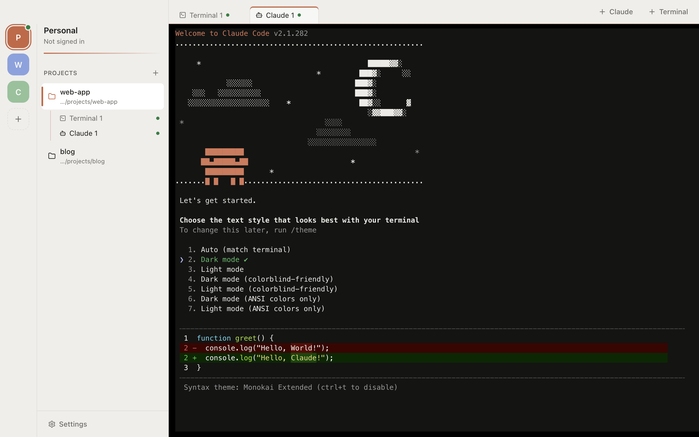
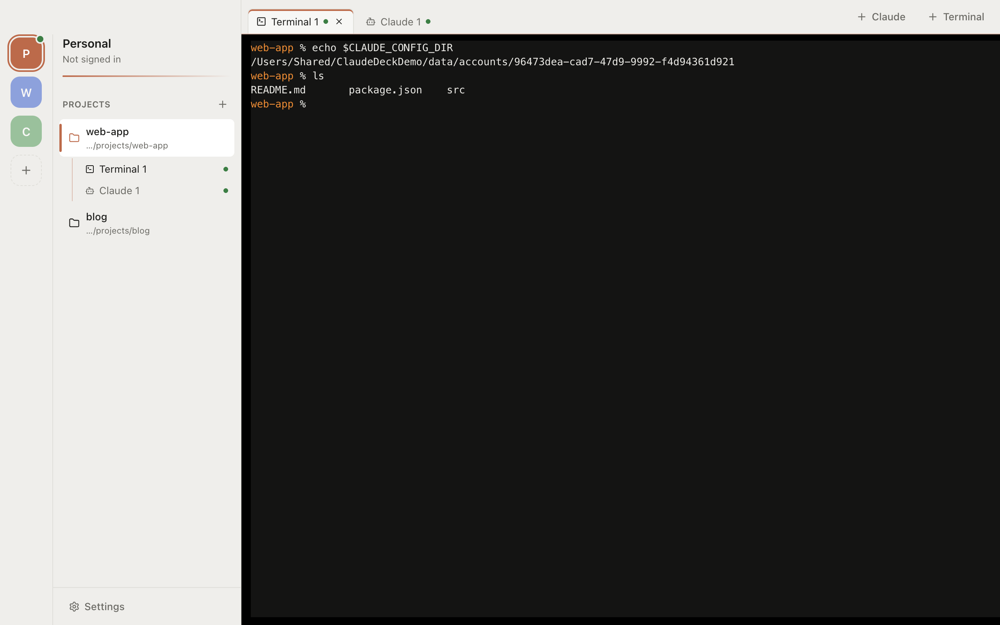
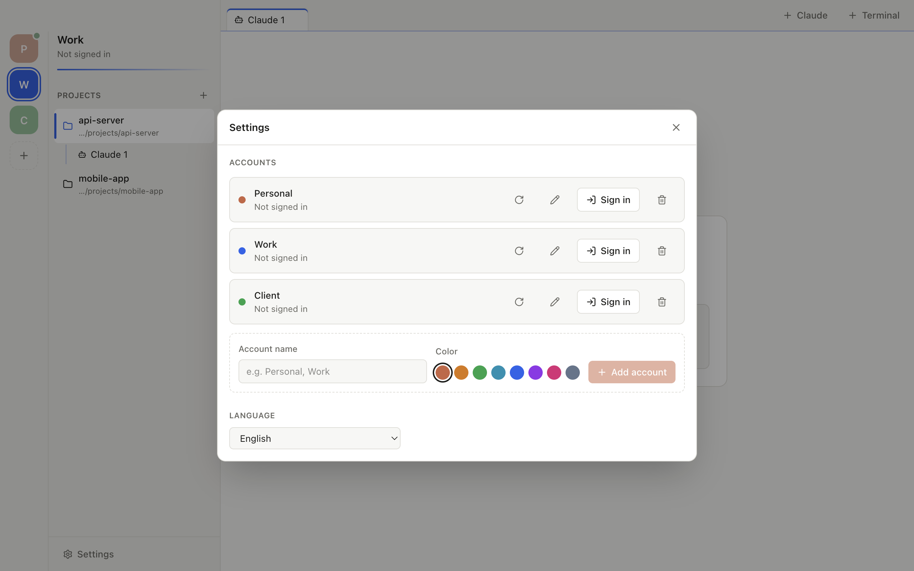
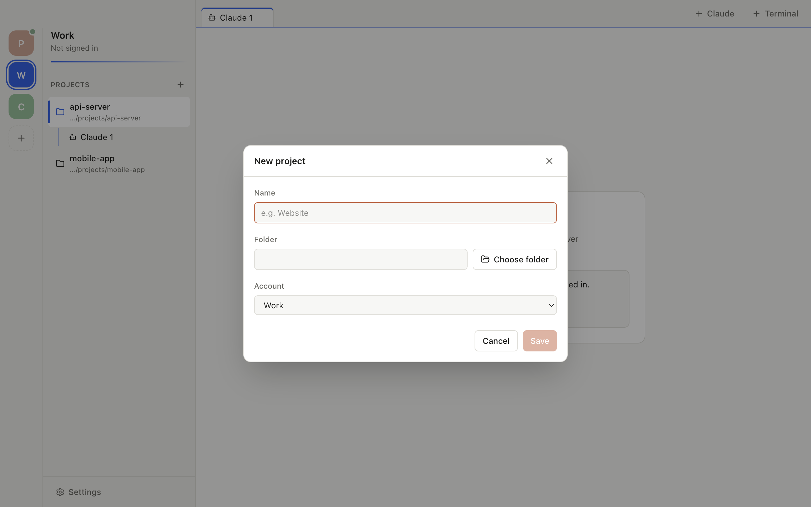
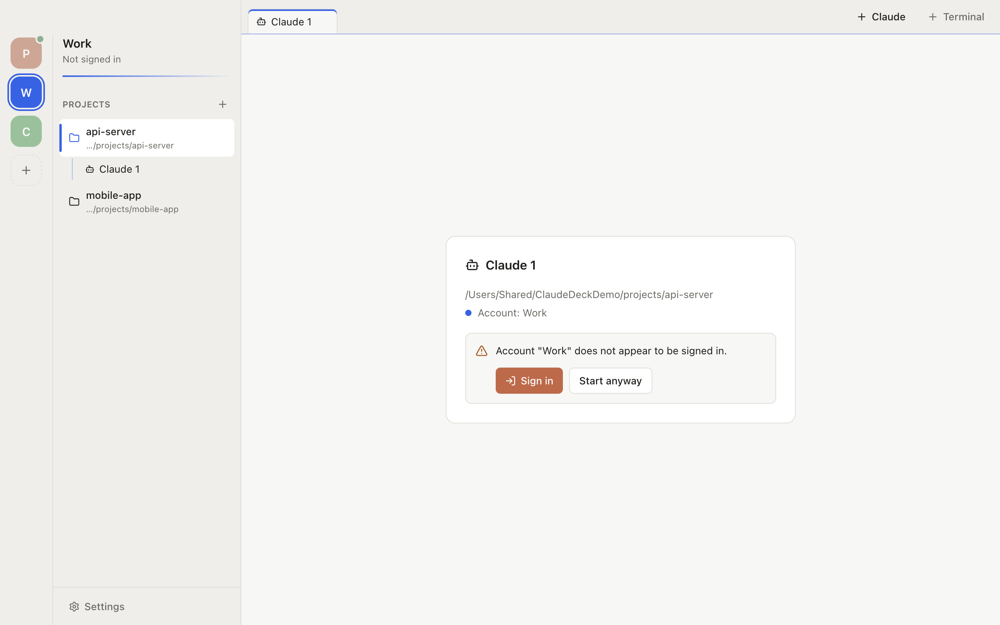

<p align="center">
  
</p>

<h1 align="center">ClaudeDeck</h1>

<p align="center">
  Assign multiple Claude Pro/Max accounts to your projects and open <code>claude</code> terminals that run with the right account.
</p>

<p align="center">
  <a href="https://github.com/FurkanZhlp/ClaudeDeck/releases/latest"><strong>Download the latest release</strong></a>
</p>



## Why

If you keep separate Claude accounts for personal and work use, switching between them in Claude Code means signing out and back in every time. In ClaudeDeck you assign an account to a project once, and every Claude tab you open in that project starts with that account. Projects on different accounts run side by side.

## Features

- **Multiple accounts:** each account uses its own isolated Claude Code config directory. Accounts never mix, and your existing `~/.claude` setup is left untouched.
- **Account rail:** switch accounts from colour-coded badges on the left; each account shows only its own projects and remembers the last project and tab you used.
- **Per-project account:** a project is a folder plus an account. Change the account and new tabs open with the new one.
- **Tabs:** as many Claude and plain Terminal tabs per project as you like. Background tabs keep running.
- **Resume per tab:** each Claude tab remembers its own conversation, so you can pick it up again after restarting the app.
- **English and Turkish UI:** follows the system language by default, switchable in Settings.
- **Guided sign-in:** an animated, step-by-step sign-in screen instead of a raw terminal.
- **Update notifications:** the app tells you when a new release is out.

| Account isolation | Settings |
| --- | --- |
|  |  |
| **New project** | **Signed-out account warning** |
|  |  |

## Installation

Requirements: an Apple Silicon Mac and [Claude Code](https://docs.claude.com/en/docs/claude-code):

```bash
curl -fsSL https://claude.ai/install.sh | bash
```

1. Download the `.dmg` from [Releases](https://github.com/FurkanZhlp/ClaudeDeck/releases/latest) and drag ClaudeDeck into Applications.
2. The app is not notarized by Apple yet, so macOS may block the first launch. If it does, run this once:

   ```bash
   xattr -dr com.apple.quarantine /Applications/ClaudeDeck.app
   ```

## Usage

1. Add an account in **Settings > Accounts**. A window runs `claude auth login`; sign in with that account in your browser.
2. Create a project with **+** in the sidebar: pick a folder and assign an account.
3. Open a tab with **+ Claude** or **+ Terminal** in the top bar.

Links in the terminal open with Cmd+click.

## How it works

Claude Code keeps its session and settings in the directory given by `CLAUDE_CONFIG_DIR`. ClaudeDeck creates `~/Library/Application Support/ClaudeDeck/accounts/<id>/` for each account and starts Claude with that variable. The variable is passed on the command line again so your shell config (`.zshrc` and friends) cannot override it, and credential variables such as `ANTHROPIC_API_KEY` are removed from Claude tabs.

Claude Code stores credentials in the macOS Keychain itself. ClaudeDeck never reads or stores tokens.

## Development

```bash
pnpm install
pnpm dev          # development mode
pnpm test         # unit tests (Vitest)
pnpm lint
pnpm typecheck
pnpm build:mac    # dist/claudedeck-<version>-arm64.dmg
```

```
src/main      Electron main process: state store, account service, PTY manager, update check, IPC
src/preload   Narrow API exposed to the renderer (contextBridge)
src/renderer  React UI, xterm.js terminal pool
src/shared    Types, IPC contract, en/tr translations
docs/         Design, implementation plan, screenshots
```

To ship a release, bump `version` in `package.json`, build with `pnpm build:mac`, then create a GitHub release tagged `v<version>` with the `.dmg` attached. The app checks the `releases/latest` endpoint.

## Disclaimer

ClaudeDeck is an independent project and is not affiliated with Anthropic.
